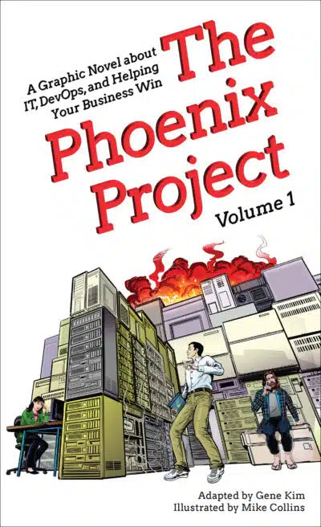

# Parts Unlimited

**Parts Unlimited** is an example eCommerce website site based for training purposes on the website described in 

[The Phoenix Project Graphic Novel: Volume 1, by Gene Kim, Mike Collins, © 2024 IT Revolution Press LLC, Portland, OR](https://itrevolution.com/product/the-phoenix-project-graphic-novel-volume-1/). 

Resemblance to “Project Unicorn” in the novel is intentional; resemblance to any real company is purely coincidental.

To read more about this project, please view the [Getting Started docs](docs/GettingStarted.md). The website includes product listings by category, product details, shopping cart, order history, product recommendations, search, and more.  To get started learning about building and managing the site, visit the Parts Unlimited docs for hands-on labs. 

NOTE: The original code for this repository can be found here: https://github.com/microsoft/partsunlimitede2e. This repository is a modified copy of the original repository and is used for demonstration and training purposes only.

## Key Features
- Works with Visual Studio 2013 Update 4 (other versions may work but not tested)
- Uses ASP.NET 4.5
- Modern HTML5 responsive layout using bootstrap for mobile, tablet, and PC
- Designed for Azure Websites, including Testing in Production, Staging slots and environment variables for feature flags (to turn off recommendations)
- Basic administration pages to add or edit product information
- Includes Azure RM JSON templates and PowerShell automation scripts to easily build and provision your environment

**Media Elements and Templates.** You may copy and use images, clip art, animations, sounds, music, shapes, video clips and templates provided with the sample application and identified for such use in documents and projects that you create using the sample application. These use rights only apply to your use of the sample application and you may not redistribute such media otherwise.
